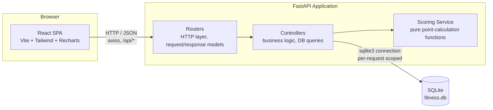
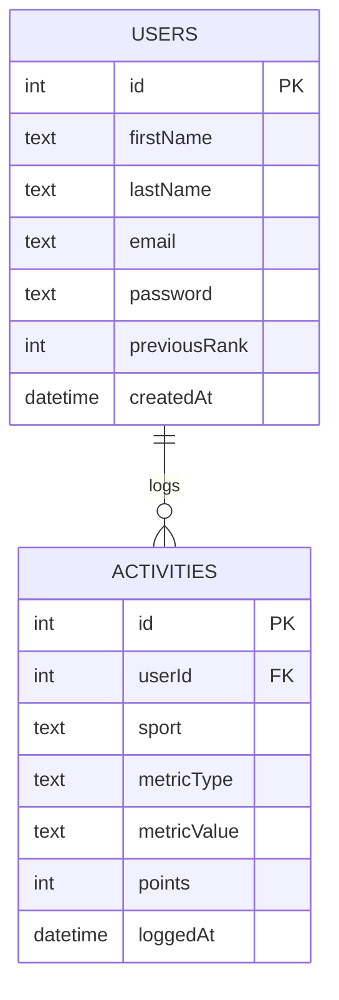

# Fitness Challenge Application — Design Document

## Overview

A full-stack application that lets users log fitness activities across six sport
types, normalizes them into a single "Points" metric, and ranks users on a
global leaderboard. Each user also gets a personal dashboard visualizing their
activity history, sport preferences, and points trend over time.

**Stack:** FastAPI (Python) + SQLite on the backend, React (Vite) + Tailwind CSS
+ Recharts on the frontend.

---

## 1. System Architecture & Data Flow

### 1.1 High-level overview



The backend is intentionally layered so each piece has one job:

- **Routers** (`routers/users.py`, `routers/activities.py`) declare the HTTP
  routes, request/response Pydantic models, and documented status codes. They
  contain no business logic — each route handler is a one-line delegation to a
  controller function.
- **Controllers** (`controllers/user_controller.py`, `controllers/activity_controller.py`)
  hold the actual business logic: looking up users, checking existence,
  assembling dashboard data, computing the leaderboard, and running SQL
  queries against the database connection handed to them.
- **Services** (`services/scoring_service.py`, `services/auth_service.py`)
  are single-purpose modules with no database or HTTP awareness at all.
  `scoring_service` takes a sport and a metric value string and returns an
  integer point value; `auth_service` handles password hashing/verification
  (bcrypt) and JWT creation/verification (pyjwt). Both are pure functions
  with no side effects, trivially unit-testable in isolation from the rest
  of the app.
- **Dependencies** (`dependencies.py`) holds `get_current_user_id`, a
  FastAPI dependency that any protected route can require — it verifies the
  incoming access token and resolves it to a real userId, rejecting the
  request with 401 if the token is missing, expired, or invalid. This is
  the single enforcement point for authentication across the whole API;
  routes opt in by declaring it, rather than each route reimplementing its
  own check.
- **Database** (`database.py`) owns connection creation and lifecycle. A new
  SQLite connection is created per request via a FastAPI dependency
  (`get_db`), which commits on success and rolls back on any unhandled
  exception, then always closes the connection — so a failed request can
  never leave a half-written row behind.

The frontend mirrors this separation: **pages** (`Leaderboard.jsx`,
`Dashboard.jsx`, `Register.jsx`, `Login.jsx`) own data-fetching and
page-level state;
**components** (`LeaderboardTable.jsx`, `StatsSummary.jsx`,
`SportBreakdownChart.jsx`, `PointsOverTimeChart.jsx`, `ActivityHistory.jsx`,
`LogActivityForm.jsx`) are presentational — they receive data as props and
render it, with no knowledge of the API. `api/client.js` is the single point
of contact with the backend; every network call in the app goes through it.

### 1.2 Request/response flow — User Registration

1. User fills in first name, last name, password, and (optionally) email on
   `Register.jsx` and submits the form.
2. The frontend calls `POST /api/users/register` with
   `{ firstName, lastName, password, email? }`.
3. FastAPI validates the body against `UserRegisterRequest` (via Pydantic) —
   trims whitespace, rejects blank/oversized names, requires the password to
   be at least 8 characters, validates email format if present. A failure
   here returns **422** (FastAPI/Pydantic's standard response for request
   validation failures — see Section 6 for why this project sticks with
   that default rather than overriding it).
4. The `users` router delegates to `register_user()` in the user controller,
   which hashes the password with bcrypt (`services/auth_service.py`) —
   the plain-text password is never stored or logged anywhere — then runs
   an `INSERT` into the `users` table.
5. The table has a `UNIQUE(firstName, lastName)` constraint. If the insert
   violates it, SQLite raises `IntegrityError`, which the controller catches
   and converts into a **409 Conflict** with a descriptive message.
6. On success, the controller generates a signed JWT (`create_access_token`)
   and returns `{ userId, message, accessToken, tokenType }` — registering
   doubles as an immediate login, no separate login step required right
   after signing up.
7. The frontend stores `{ userId, name, accessToken }` in `localStorage`
   (see Section 5.4) and redirects to `/dashboard/:userId`.

### 1.3 Request/response flow — Login

1. An existing user fills in first name, last name, and password on
   `Login.jsx` and submits the form.
2. The frontend calls `POST /api/users/login` with
   `{ firstName, lastName, password }`.
3. The `users` router delegates to `login_user()` in the user controller,
   which looks the user up by `firstName` + `lastName`, then checks the
   submitted password against the stored bcrypt hash
   (`verify_password`).
4. If the name doesn't exist, or the password doesn't match, the controller
   raises the exact same **401 Unauthorized** response either way — this is
   deliberate, to prevent an attacker distinguishing "no such user" from
   "wrong password" by watching for a different error message (a
   "username enumeration" defense).
5. On success, a fresh JWT is generated and returned as
   `{ userId, name, accessToken, tokenType }`.
6. The frontend stores the same `{ userId, name, accessToken }` shape as
   registration does, and redirects to `/dashboard/:userId` — this is what
   makes it possible to return to a previously registered account after
   logging out, closing the gap described in the previous version of this
   document's trade-offs section.

### 1.4 Request/response flow — Activity Ingestion

1. From their own dashboard, a user opens the "Log Activity" modal, picks a
   sport, and fills in the metric value in the format appropriate to that
   sport (distance in km, duration in MM:SS, or a step count).
2. The frontend calls `POST /api/activities` with
   `{ sport, metricType, metricValue }` — no `userId` field. `api/client.js`
   attaches the stored access token as an `Authorization: Bearer <token>`
   header automatically, via an axios request interceptor, on every call.
3. FastAPI's `HTTPBearer` security scheme rejects the request outright with
   **401** if the `Authorization` header is missing or malformed, before
   any application code runs. If a token is present, `dependencies.get_current_user_id`
   decodes and verifies it (`services/auth_service.decode_access_token`) —
   an expired or tampered token also returns **401**, this time raised
   explicitly by that dependency once it's actually run.
4. Pydantic validates the payload against `ActivityRequest`: the `sport` and
   `metricType` must be a valid pairing (e.g. `running` must pair with
   `distance`, not `duration`), and `metricValue` must match the expected
   format and be positive. Any failure here returns **422**.
5. The `activities` router delegates to `log_activity()` in the activity
   controller, passing along the verified `current_user_id` from the token
   — never a client-supplied value — as this activity's true owner.
6. The controller calls `calculate_points(sport, metricValue)` in the scoring
   service, which applies the correct conversion rate and flooring rule for
   that sport (Section 4).
7. The activity — owned by `current_user_id`, including the already-computed
   `points` — is inserted into the `activities` table.
8. The full saved activity (with its new `activityId` and server-assigned
   `loggedAt` timestamp) is returned to the frontend.
9. The frontend closes the modal and re-fetches the dashboard, so the new
   activity, updated totals, and updated charts appear immediately.

---

## 2. Database Schema & Data Model

### 2.1 Entity-relationship diagram



### 2.2 Tables

**`users`**

| Column         | Type     | Notes                                              |
|----------------|----------|-----------------------------------------------------|
| `id`           | INTEGER  | Primary key, autoincrement                          |
| `firstName`    | TEXT     | Required                                             |
| `lastName`     | TEXT     | Required                                             |
| `email`        | TEXT     | Optional                                             |
| `password`     | TEXT     | Required. A bcrypt hash, never the plain-text password — see Section 5.4. |
| `previousRank` | INTEGER  | Nullable. Rank from the last leaderboard fetch — used only to compute trend direction (Section 5.3), not a business field the user sees directly. |
| `createdAt`    | DATETIME | Defaults to insert time. Used as the leaderboard tie-breaker. |

`UNIQUE(firstName, lastName)` is declared directly on the table.

**`activities`**

| Column        | Type     | Notes                                              |
|---------------|----------|-----------------------------------------------------|
| `id`          | INTEGER  | Primary key, autoincrement                          |
| `userId`      | INTEGER  | Foreign key → `users.id`                             |
| `sport`       | TEXT     | One of `running`, `walking`, `cycling`, `gym`, `swimming`, `steps` |
| `metricType`  | TEXT     | One of `distance`, `duration`, `count`               |
| `metricValue` | TEXT     | Raw value as submitted (e.g. `"5.5"`, `"1:30"`, `"8500"`) |
| `points`      | INTEGER  | Computed once at write time by the scoring service, never recalculated on read |
| `loggedAt`    | DATETIME | Defaults to insert time                              |

### 2.3 Design decisions worth calling out

- **No separate `leaderboard` table.** The leaderboard is a `GROUP BY`/`SUM`
  aggregate query over `activities`, joined to `users`, run fresh on every
  request (see the query in `activity_controller.get_leaderboard`). This
  keeps `activities` as the single source of truth — there's no risk of a
  cached leaderboard table drifting out of sync with the activity log. The
  trade-off is discussed in Section 6.
- **Duplicate-user prevention is enforced at the database level**, not just
  checked in application code before an insert. A `UNIQUE` constraint means
  even if two registration requests for the same name arrived at the exact
  same moment (a race condition), SQLite itself would reject the second
  insert — a pure application-level "check then insert" pattern would be
  vulnerable to that race.
- **`points` is stored, not derived on read.** Storing the computed value
  means historical activities keep their original points even if the scoring
  formula changes in the future, and leaderboard/dashboard queries only need
  to `SUM` an existing column rather than recompute scoring logic in SQL.
- **`metricValue` is a single generic TEXT column**, not three separate
  typed columns (`distanceKm`, `durationSeconds`, `stepCount`). This keeps
  the schema and the request/response shape simple — one field regardless of
  sport — at the cost of the value not being a queryable/sortable number at
  the database level. Since every current use case (scoring, display) parses
  the string in application code anyway, this was judged an acceptable
  trade-off for this project's scope.

---

## 3. API Specifications

All routes are prefixed with `/api`. Every error response follows the same
shape: `{ "detail": { "error": "...", "message": "..." } }`.

### `POST /api/users/register`

Registers a new user and immediately logs them in.

**Request body**
```json
{ "firstName": "Jane", "lastName": "Doe", "password": "at-least-8-chars", "email": "jane@example.com" }
```
`email` is optional. `firstName`/`lastName` are required, 1–50 characters,
whitespace-trimmed, cannot be blank. `password` is required, 8–72
characters (72 is bcrypt's own maximum input length).

**Responses**

| Status | When                                              |
|--------|---------------------------------------------------|
| 201    | Success — returns `{ userId, message, accessToken, tokenType }` |
| 422    | Missing/invalid fields (e.g. blank name, bad email format, password too short) |
| 409    | A user with the same first + last name already exists |

### `POST /api/users/login`

Verifies credentials for an existing user and returns a fresh access token.

**Request body**
```json
{ "firstName": "Jane", "lastName": "Doe", "password": "at-least-8-chars" }
```

**Responses**

| Status | When                                              |
|--------|---------------------------------------------------|
| 200    | Success — returns `{ userId, name, accessToken, tokenType }` |
| 422    | Missing/invalid fields                            |
| 401    | No account matches the given name + password (same message whether the name doesn't exist or the password is wrong) |

### `POST /api/activities`

Logs a fitness activity, attributed to the authenticated caller, and
returns the points awarded.

**Requires** an `Authorization: Bearer <accessToken>` header — there is no
`userId` field in the request body at all; the activity's owner is always
derived from the verified token.

**Request body**
```json
{ "sport": "running", "metricType": "distance", "metricValue": "5.5" }
```

**Validation rules**
- `sport` must be one of the six supported values.
- `metricType` must match `sport` per the fixed mapping (running/walking/cycling
  → `distance`; gym/swimming → `duration`; steps → `count`).
- `metricValue` format must match `metricType`: a positive decimal string for
  distance, `MM:SS` for duration, a positive integer string for steps.

**Responses**

| Status | When                                              |
|--------|---------------------------------------------------|
| 201    | Success — returns `{ activityId, pointsAwarded, sport, metricType, metricValue, loggedAt }` |
| 401    | Missing, expired, or invalid access token          |
| 422    | Schema validation failure or mismatched sport/metricType |

### `GET /api/activities/leaderboard`

Returns the global leaderboard.

**Response**
```json
{
  "leaderboard": [
    { "rank": 1, "userId": 1, "name": "Alice Johnson", "totalPoints": 4070, "trend": "same" }
  ],
  "totalUsers": 8
}
```
Only users with at least one logged activity appear. Ranked by total points
descending; ties broken by earliest registration date. `trend` (`up` /
`down` / `same`) is computed by comparing the current rank to the rank
recorded on the *previous* fetch (Section 5.3).

### `GET /api/users/{userId}/dashboard`

Returns full personal dashboard data for one user.

**Response**
```json
{
  "userId": 1,
  "name": "Alice Johnson",
  "totalPoints": 4070,
  "totalActivities": 7,
  "topSport": "running",
  "activities": [ { "id": 7, "sport": "running", "metricType": "distance", "metricValue": "6.0", "points": 600, "loggedAt": "2026-08-16T19:51:54" } ],
  "sportBreakdown": [ { "sport": "running", "totalPoints": 2950, "percentage": 72.48 } ],
  "pointsOverTime": [ { "date": "2026-08-03", "points": 1000 } ]
}
```

| Status | When                       |
|--------|----------------------------|
| 200    | Success                    |
| 404    | `userId` does not exist    |

### `GET /health`

Simple liveness check, returns `{ "status": "healthy", "version": "1.0.0" }`.
Used to confirm the API process is up; does not check database connectivity.

### Error handling strategy

One exception handler registered globally in `main.py`, for any unhandled
exception → **500 Internal Server Error** with a generic message, so raw
stack traces never leak to the client.

Request validation failures (missing/invalid fields, or the cross-field
`model_validator` check catching a mismatched sport/metricType combination)
are *not* separately handled — they're left to FastAPI/Pydantic's built-in
`RequestValidationError` handling, which returns **422 Unprocessable
Entity** by default. See Section 6 for why this project deliberately keeps
that default rather than overriding it to 400.

`404` (not found) and `409` (duplicate user) are raised explicitly inside
the relevant controller functions, since they represent business-logic
outcomes rather than request-parsing failures.

`401` is raised in two different places, worth distinguishing: FastAPI's
`HTTPBearer` security scheme itself rejects a request with 401 if the
`Authorization` header is missing entirely, before any of this project's
own code runs; `dependencies.get_current_user_id` raises a 401 explicitly
if a header *is* present but the token inside it is expired or invalid.
`login_user()` in the user controller also raises 401 for a failed
name/password combination — a business-logic outcome, same category as
404/409, just reusing the 401 status code for a different reason than the
token-verification cases above.

---

## 4. Scoring & Normalization Logic

All scoring lives in `services/scoring_service.py`, behind a single public
function, `calculate_points(sport, metric_value)`, so there is exactly one
place in the codebase that knows how points are calculated.

### 4.1 Conversion rates

| Activity     | Metric        | Rate            |
|--------------|---------------|------------------|
| Running      | 1 km          | 100 points       |
| Walking      | 1 km          | 50 points        |
| Cycling      | 1 km          | 25 points        |
| Swimming     | 1 minute      | 15 points        |
| Gym          | 1 minute      | 5 points         |
| Daily Steps  | 100 steps     | 1 point          |

### 4.2 Flooring rules

**Distance sports** (running, walking, cycling): points are calculated
first, then the *final result* is floored.

```
points = floor(distance_km × rate)
```
Example: 1.55 km walking → `1.55 × 50 = 77.5` → floored to **77**.

**Duration sports** (gym, swimming): only fully completed minutes count —
seconds are discarded *before* multiplying by the rate, not floored after.

```
whole_minutes = floor(MM:SS to whole minutes)   # seconds simply dropped
points = whole_minutes × rate
```
Example: 1:55 of gym → 1 whole minute (55 seconds discarded) → `1 × 5` =
**5** points.

**Steps**: the step count is floored to the nearest complete block of 100
*before* the point calculation, not after.

```
complete_blocks = floor(steps / 100)
points = complete_blocks × 1
```
Example: 399 steps → `floor(399 / 100) = 3` blocks → **3** points.

These three rules are implemented as three separate internal helper
functions (`_calculate_distance_points`, `_calculate_duration_points`,
`_calculate_steps_points`), each with the flooring applied at the specific
stage the assignment specifies — distance floors the final result, duration
floors the input before multiplying, and steps floors the input before
dividing conceptually into blocks. Keeping these as separate functions
(rather than one generic formula) makes each rule's behavior easy to verify
independently and matches the assignment's three visibly different flooring
semantics.

---

## 5. Frontend Architecture & Visualizations

### 5.1 Component breakdown

```
App.jsx                        — nav bar + route table, tracks current-user identity
├── pages/Leaderboard.jsx       — fetches leaderboard, renders LeaderboardTable
├── pages/Register.jsx          — registration form (password included)
├── pages/Login.jsx             — login form for returning users
└── pages/Dashboard.jsx         — fetches one user's dashboard data
    ├── components/StatsSummary.jsx        — 3 summary stat cards
    ├── components/PointsOverTimeChart.jsx — Recharts area chart
    ├── components/SportBreakdownChart.jsx — Recharts donut chart
    ├── components/ActivityHistory.jsx     — activity log table
    └── components/LogActivityForm.jsx     — "Add Activity" modal

components/LeaderboardTable.jsx  — used by Leaderboard.jsx
```

Pages own data-fetching and loading/error state; components are purely
presentational, receiving already-fetched data as props and rendering it.
This separation means every chart/table component can be tested or reused
independently of the network layer.

### 5.2 Data fetching pattern

Every page follows the same shape, built on two hooks:

- `useState` holds the fetched data, plus `isLoading`/`error` flags.
- `useEffect` triggers the fetch when the page mounts (and, on the dashboard,
  again whenever the URL's `userId` changes, or after a new activity is
  logged — see below).

Each fetch effect includes cancellation guarding (an `isCancelled` flag
checked before every state update, flipped by the effect's cleanup
function) so a component that unmounts mid-request never tries to update
state that no longer exists on screen.

The dashboard additionally tracks a `refreshKey` counter in its effect's
dependency array. Logging a new activity increments this counter, which
re-triggers the exact same fetch effect — reusing one code path for both
"initial load" and "reload after a write," rather than maintaining two
separate fetch implementations.

### 5.3 Ranking calculation strategy

Ranking is computed entirely server-side, in SQL, on every leaderboard
request — not cached, and not recalculated on the frontend. The query
sums each user's activity points, orders by total points descending with
earliest registration date as the tie-breaker, and only includes users with
at least one logged activity. Rank *trend* (up/down/same) is derived by
comparing each user's rank in the current result against a `previousRank`
value stored on their user row, which gets overwritten with their new rank
at the end of every leaderboard fetch. The frontend has no ranking logic of
its own — `LeaderboardTable.jsx` simply renders whatever rank and trend the
backend already computed.

### 5.4 Authentication

The original assignment did not require or mention authentication at all;
it was added afterward, on this branch, once the core requirements were
complete. It replaces an earlier version of this app (still reflected on
the `main` branch) where identity was just a `userId` cached in
`localStorage` with no password and no server-side enforcement — that
version is described, and its specific gaps are named, in the git history
of this document and in `main`'s copy of `DESIGN.md`.

**Password storage.** Passwords are hashed with bcrypt
(`services/auth_service.hash_password`) before ever reaching the database
— bcrypt generates a random salt per call, so two users with the same
password never produce identical stored hashes, and the hash is
one-directional (there is no way to recover the original password from
it, only to check whether a *given* password produces the same hash via
`verify_password`).

**Tokens.** On successful registration or login, the backend issues a JWT
(`create_access_token`) — a signed string encoding the user's id and an
expiry time (`JWT_EXPIRE_MINUTES`, 60 by default), signed with a secret key
(`JWT_SECRET_KEY`, kept in `backend/.env`, never committed to git). The
signature is what makes the token trustworthy: anyone can read a JWT's
contents (it isn't encrypted, just signed), but nobody can forge or alter
one without invalidating the signature, since they don't have the secret
key.

**Client-side storage and attachment.** The frontend stores
`{ userId, name, accessToken }` in `localStorage` (`utils/currentUser.js`).
`api/client.js` registers an axios **request interceptor** that reads the
stored token and attaches it as an `Authorization: Bearer <token>` header
to *every* outgoing request automatically — routes that don't check for
it (leaderboard, dashboard, register, login) simply ignore the header;
only `POST /api/activities` actually requires and verifies it.

**Server-side enforcement.** This is the part that distinguishes this
implementation from simply gating a login page: `POST /api/activities`
declares `current_user_id: int = Depends(get_current_user_id)`
(`dependencies.py`) as a required dependency. That dependency decodes and
verifies the token, and the resulting userId — never a client-supplied
value — is what the activity actually gets saved under. There is no
`userId` field left in the request body for a client to spoof at all
(see Section 1.4 and Section 3). `App.jsx` and `Dashboard.jsx` still read
the cached identity to decide what the nav bar and "Add Activity" button
show, but that's purely a UX convenience now, layered on top of real
server-side enforcement — not, as in the previous version, the *only*
thing standing between a user and logging activities as someone else.

### 5.5 Visualization choices

- **Sport breakdown → donut chart** (Recharts `PieChart` with a nonzero
  `innerRadius`). A part-to-whole relationship (how a user's total points
  split across sports) is what pie/donut charts communicate best; the donut
  hole leaves room to place total points centrally if wanted later.
- **Points over time → area chart**, not a bar chart, because the point is
  to show a continuous *trend* across days, and the shaded area under the
  line reinforces cumulative volume rather than just plotting isolated
  daily values.
- Both charts render a fully custom empty state ("No activity data yet")
  rather than an empty/broken chart, since a brand-new user will have no
  data in either dataset yet.

---

## 6. Trade-offs & Edge Cases

**Authentication trade-offs.** Password + JWT auth is now real and
enforced server-side (Section 5.4) — but the specific implementation still
has known limitations worth naming honestly:
- **No token revocation.** Logging out client-side only clears
  `localStorage` — it does not invalidate the token server-side. A token
  issued before logout remains technically valid, and would still be
  accepted by `POST /api/activities`, until it naturally expires
  (`JWT_EXPIRE_MINUTES`, 60 minutes by default). A production system
  wanting immediate revocation would need a server-side token blocklist or
  short-lived tokens paired with a separate, revocable refresh token.
- **No refresh token.** Once a token expires, the user must log in again
  from scratch — there's no silent renewal. Acceptable for this project's
  scope (60 minutes is generous for a demo/assessment session), but a
  production app would likely pair a short-lived access token with a
  longer-lived refresh token to avoid interrupting active users.
- **Token stored in `localStorage`, not an httpOnly cookie.** This makes
  the token readable by any JavaScript running on the page — including,
  in a worst case, an injected malicious script (XSS). An httpOnly cookie
  would be inaccessible to JavaScript entirely, closing that specific
  attack surface, at the cost of needing CSRF protection instead (a
  different trade-off, not a strictly safer one without further work).
  `localStorage` was chosen here for simplicity, consistent with how this
  project already used it for the pre-auth identity system.
- **No rate limiting on login attempts.** `POST /api/users/login` can be
  called as many times as desired with different passwords, with no
  lockout or throttling — a real deployment would need this to resist
  brute-force password guessing.
- **No password reset flow.** If a user forgets their password, there is
  currently no recovery path at all — this would typically require email
  delivery, which is out of scope here since email is only an optional,
  unverified field on this project.

**Leaderboard computed live, not cached.** Every call to
`GET /activities/leaderboard` runs a full `GROUP BY`/`SUM` aggregate over
the entire `activities` table. At this project's scale (a handful of users,
tens of activities) this is effectively instant and keeps the implementation
simple with zero risk of a stale cached value. At a much larger scale
(thousands of users, high request volume), this would need revisiting —
e.g. a periodically refreshed materialized leaderboard, or caching with a
short TTL — since re-aggregating the full activity table on every page view
would not scale indefinitely.

**No pagination.** Both the leaderboard and a user's activity history return
their full result set in one response. Acceptable at the current data
volume; a real production system would paginate both endpoints once
user/activity counts grow large enough that a single response becomes slow
or unwieldy to render.

**Concurrency handling.** Each request gets its own SQLite connection
(`database.get_db`, a FastAPI dependency), which commits on success and
rolls back on any exception — so a failed request can never leave a
partial write behind. The database runs in WAL (write-ahead log) mode,
which allows concurrent reads to proceed without blocking on a write in
progress. SQLite still serializes concurrent *writes* (only one writer at a
time) — a known constraint of a single-file database. At this project's scale (a handful of users, occasional
activity logging) that constraint has no practical impact. A system
expecting heavy concurrent write traffic would need a client-server
database (e.g. PostgreSQL) instead.

**Duplicate-user prevention is race-safe.** Because the `UNIQUE(firstName,
lastName)` constraint lives in the database schema itself rather than being
checked in application code before the insert, two simultaneous
registration attempts for the same name cannot both succeed — SQLite
rejects the second insert outright, regardless of timing.

**422, not 400, for validation errors.** The assignment's requirements
section names "400 Bad Request" for invalid schemas or mismatched
sport/metric types. FastAPI/Pydantic's actual default for this case is 422
Unprocessable Entity — the HTTP-spec-correct code for "the request was
well-formed, but its content failed validation," as distinct from 400,
which is meant for a request that's malformed at the syntax level (e.g.
invalid JSON). Since FastAPI was the explicitly chosen stack for this
project, and 422 is that stack's own idiomatic, spec-aligned behavior for
this exact situation, this project reads the assignment's mention of "400"
as shorthand for "an appropriate 4xx client error" rather than a literal
requirement to override the framework's own convention. Sticking with 422
avoids introducing a custom exception handler purely to fight against the
chosen framework's standard behavior.

**Sport-to-metric mapping is duplicated.** Both the backend
(`VALID_SPORT_METRIC_MAP` in `models/schemas.py`) and the frontend
(`SPORT_METRIC_MAP` in `LogActivityForm.jsx`) independently define which
metric type each sport requires. The frontend needs its own copy to decide
which input fields to render *before* a request is ever sent; the backend
copy remains the actual source of truth and validates independently
regardless of what the frontend sends. Worth centralizing (e.g. exposing
this mapping via an API endpoint the frontend fetches once) if the sport
list were expected to change frequently; for a fixed, assignment-scoped set
of six sports, the duplication was judged an acceptable, low-risk trade-off.

**Input validation depth.** Validation is handled entirely by Pydantic
models and SQLite constraints — there is no additional rate limiting,
request throttling, or sanitization layer beyond what FastAPI/Pydantic
provide by default. Reasonable for an assessment/demo scope; a
publicly-deployed version would need rate limiting at minimum.
